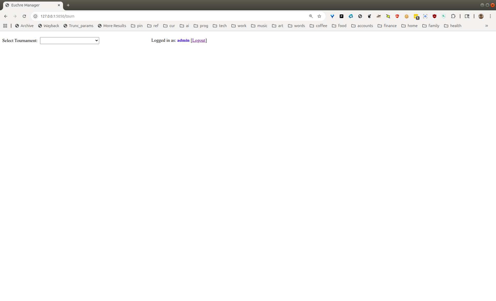
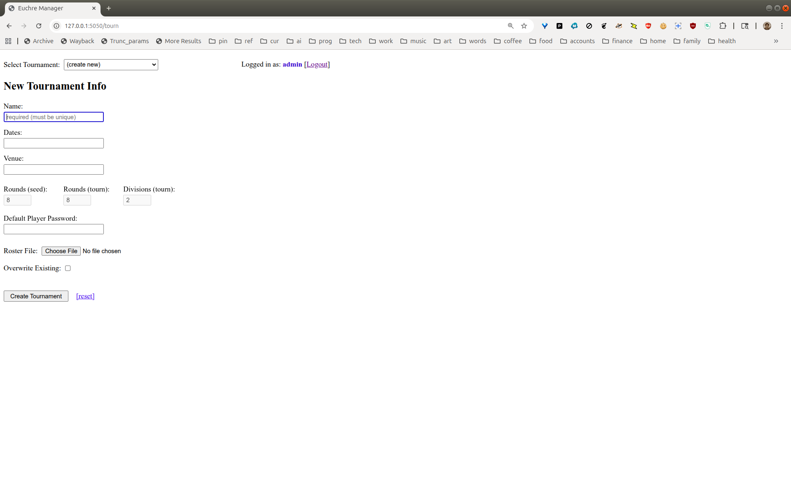
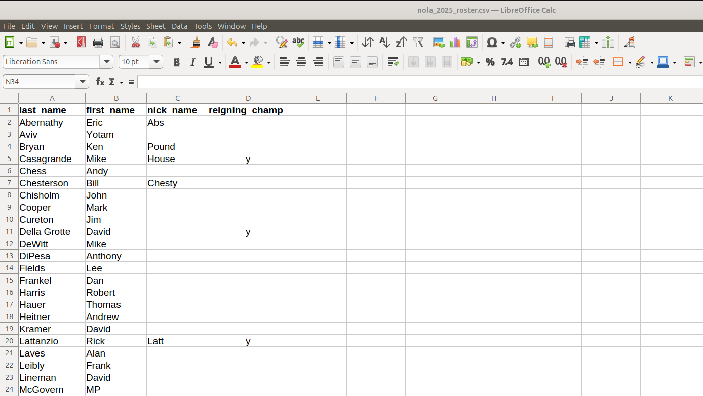
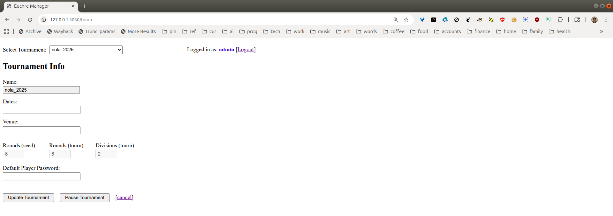
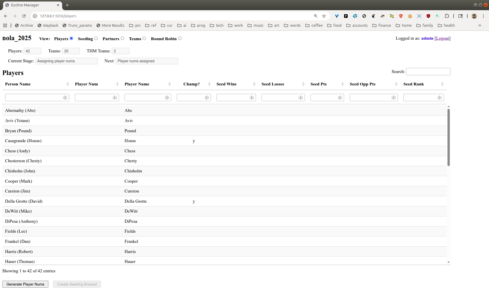
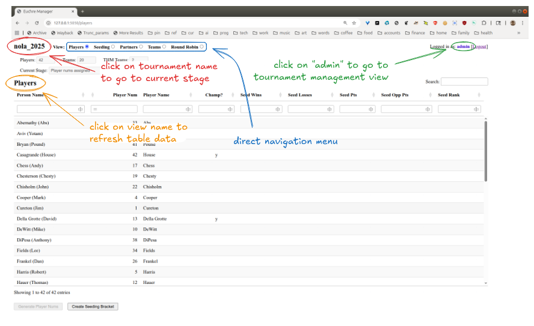
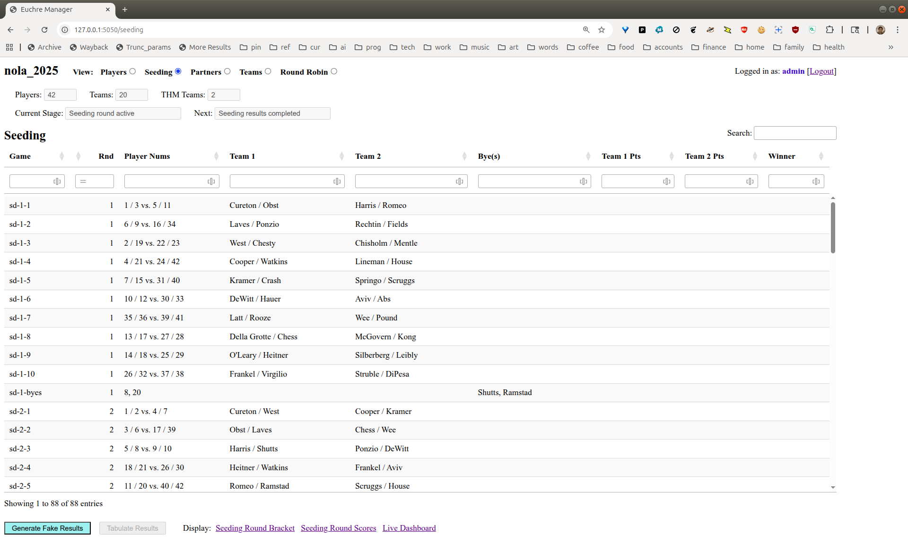
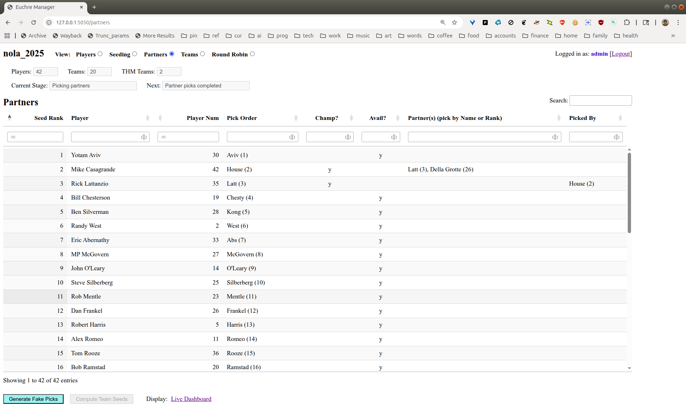
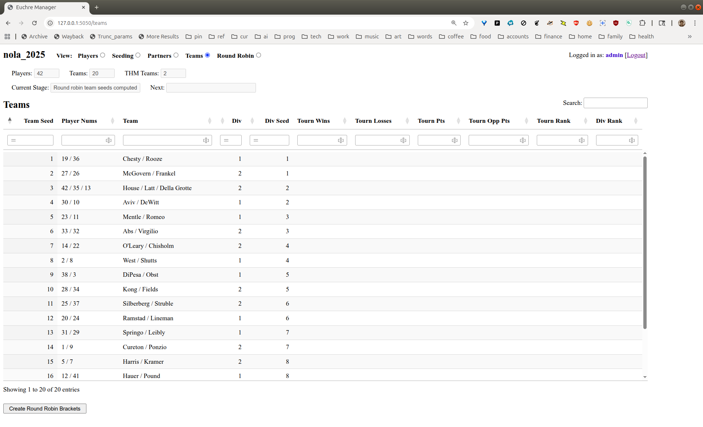

# Admin UI

## Overview

This is a quick traversal of the Euchre Manager admin UI.  In general, the screens (which
we will call "views") should be pretty intuitive, generally consisting of data in table
form (which is sortable and filterable) for the associated tournament activity, and
controls (e.g. buttons) representing admin actions for progressing the tournament through
its stages.

Here is a list of the views:

- [**Tournament**](#tournament-view) - create and manage tournaments
- [**Players**](#players-view) - manage player info and track player seeding round stats
- [**Seeding**](#seeding-view) - track and manage seeding round brackets and games
- [**Partners**](#partners-view) - track and manage the partner picking process
- [**Teams**](#teams-view) - track team info (division assignments/seeds) and team round
  robin stats
- [**Round Robin**](#round-robin-view) - track and manage main tournament round robin
  brackets and games
- [**Playoffs**](#playoffs-view-not-yet-developed) - *\[not yet developed\]* track and
  report playoff rounds and final overall tournament results

Later we will add views for tracking and managing the playoff rounds, as well as computing
and reporting the final overall tournament results.

## Tournament View

Multiple tournaments may be created and managed in the application.  An tournament
instance may represent a currently running event, or may represent support for browsing
and analyzing activity and results for a past tournament (based on uploaded data).  In
addition, mock tournaments may be created for purposes of developing familiarity with the
application or testing/validating its features and workflows.

### Creating a New Tournament

After logging in as "admin", you will see the following empty Tournament Selection view:

  

From the "Select Tournament" dropdown list, choosing the "**(create new)**" option will
yield the following Create New Tournament view:

  

The following fields may be used to specify information about the tournament:

- **Name** - *\[required\]* this must be unique across all tournaments; name can include
  spaces and punctuation (other than the slash character '/')
- **Dates** - *\[optional\]* timeframe information, for reference
- **Venue** - *\[optional\]* location information, for reference
- **Default Player Password** - *\[optional\]* if specified, indicates that player
  passwords are required (later, players will be able to change their own password through
  the mobile app); can leave this blank if player passwords are not needed for this
  tournament
- **Roster File** - *\[required\]* specify a CSV file to upload (see below on the
  format)—this is required for now, since manual entry/editing of the roster through the
  app is not yet implemented
- **Overwrite Existing** - check this box if okay to overwrite a previously created
  tournament (all of its data will be deleted—later, we will support archiving of
  data for tournaments)

### Roster File Format

The uploaded roster file must be a CSV that includes the following columns (header row
should include these exact labels):

- **last\_name** - required for all players
- **first\_name** - required for all players
- **nick\_name** - optional for players
- **reigning\_champ** - specify 'y' for prior year champion players (blank for everyone
  else)

  

Note that nick names may also be specified through the mobile app during the player
registration process (see more on names, below).

### Completing Tournament Creation

Click the "**Create Tournament**" button to save the information and begin the tournament
tracking and management process.

### Managing Existing Tournaments

This capability is reached by clicking on the "**admin**" label in the upper righthand
corner of the admin UI (see note on navigation, below), and basically entails the same
screen used for creating tournaments (see above).  Certain fields may be updated here
(namely Dates, Venue, and Default Player Password), but the other fields are locked-in
once the tournament is started.

  

Note that only one tournament may be active at a time, so this view can also be used to
switch to a different tournament—either another existing tournament, or a new tournament
to be created.

Functionality:

- The admin may choose to pause the current tournament, in which case the initial empty
  Tournament Selection view will be shown.
- Or, if the admin selects a different tournament from the dropdown list—or "(create
  new)", as previously presented—, the current tournament will be implicitly paused, which
  will be indicated by an informational message at the bottom of the page.  The newly
  selected (or created) tournament will then be marked as active.

Clicking "\[cancel\]" or the "**admin**" label in the upper righthand corner of the screen,
will effect a return to the current stage for the active tournament.

## Players View

Here is the initial look of the Players view, after creation of the tournament:

  

This is basically just a representation of the roster information, with some formatting
applied to names.  The "Person Name" (which also used in the mobile app login screen) is
last name, qualified by either first name or nick name (if specified).  The "*Player*
Name" shown here is used as the identifier for the player throughout the application.  It
is used as the player name in the seeding round, and as a component of team names for the
remainder of the tournament.

Functionality:

- This view can be used to track and/or facilitate the player registration process, which
  includes assignment of "Player Num" (i.e. ping pong ball number) and specification of
  Player Name (which is either nick name, or last name \[in the absense of the former\]).
- Players may enter their ping pong ball numbers (if we are still using those) or desired
  nick names as part of the Registration stage in the mobile app.
- If a nick name is cleared out (here, or in the mobile app), the Player Name will default
  to the player's last name.
- Any player numbers not entered by the end of the registration period will be randomly
  generated by the "**Generate Player Nums**" button on this view.

### General Note on Data and Application Navigation

All of the application screens, starting from the Players view through the rest of the
tournament flow, will have a common paradigm for refreshing data and navigating around the
application, as indicated by the annotation here:

  

Explanation:

- The **view menu** (highlighted in blue) can be used to jump to the view for a **specific stage**.  Jumping
  forward (past the current stage) is allowed, but there will typically not be any data in
  the view.
- Clicking on the **tournament name** in the upper lefthand corner (highlighted in red) will always jump back to the view
  representing the **current stage** of the tournament.
- Clicking on the **view name** above the data table (highlighted in orange) will **refresh the table data** in place
  (helpful to track updates from mobile devices, since autoupdate is not currently
  implemented for admin views).
- Clicking the "**admin**" label in the upper righthand corner (highlighted in green) will jump to the **Tournament
  Management** view (see above).
  
### Completing the Player Registration

When all of the Player Nums have been entered (or generated), and Player Names finalized,
click the "**Create Seeding Bracket**" button to save the information and generate the
seeding round bracket based on the assigned player numbers.  Note that player numbers and
nick names cannot be changed after this, since they are the identifying references for all
of the players for the remainder of the tournament.

The columns representing seeding round stats and ranking for each player will be updated
by the application as scores are entered during seeding round play.

## Seeding View

Here is the initial look of the Seeding view, after player registration is complete:

  

This has all of the matchups for all of the rounds of the Seeding stage, including byes.

Functionality:

- Scores for games may be entered directly in the table here, otherwise scores are assumed
  to be entered by players through the mobile app as they are completed.
- The controls in the table header may be used to search, sort, or filter by any of the
  columns in the table.
- The links below the table may be used to display the charts and dashboards for the
  seeding round (which will opened in separate browser tabs).
  - Note that the Bracket and Scores charts must be manually refreshed (e.g. using ctrl-r)
    to pick up score updates, but the Live Dashboard will be updated automatically every 5
    seconds.
  - More detailed descriptions of the charts and dashboards will be presented separately,
    but they are meant to replicate the traditionally hand drawn sheets of paper used to
    track tournament progress and results, so they should be very familiar and mostly
    self-explanatory.

For testing and simulation purposes, the "**Generate Fake Results**" button may be used to
generate random results for all of the remaining games for the Seeding Round (not
overwriting any results already entered).

### Finalizing the Seeding Round

When scores for all games have been entered and confirmed&dagger;, the
"**Tabulate Results**" button will be enabled to compute the final ranking for all
players.  Those ranking will be used to determine the picking order for partner selection.

&dagger; *Note that admins will have the ability to manually adjust any game
scores not correctly entered, before executing the final tabulation (though this is not
yet implemented)*

The "**Tabulate Results**" button will take you to the Partners view, but you may also
want to navigate back to the Players view (using the navigation menu on the top of the
screen) to look at the player stats and rankings (which should be the same as the partner
picking order).  Afterward, you can always click on the tournament name in the top
lefthand corner to return to the current stage of the tournament.

## Partners View

Here is the intial look of the Partners view, after the seeding round results have been
tabulated:

  

Functionality:

- Similar to the other views in the app, the data (partner picks, in this case) may be
  entered here, or may be entered through the mobile app and tracked here.
- As with the Seeding view, the data in the table must be refreshed manually (by clicking
  on "Partners" above the table) to pick up updates from mobile devices.
- The "Live Dashboard" (link below the table) may be used to display (e.g. projected, or
  on a larger screen) an autoupdating view of picks as they happen (either through the
  admin interface, or from mobile entry).

For testing and simulation purposes, the "**Generate Fake Picks**" button may be used to
generate random partner picks for the remaining team pairings (again, not overwriting
existing data).

### Finalizing the Partner Picks

When all players have been selected, the "**Compute Team Seeds**" button will be enabled
to move the tournament to the process of assigning teams to divisions.

## Teams View

Here is the initial look of the Teams view, after the partner picks have been finalized:

  

This page shows the teams produced by the partner picking process, ordered by team seed,
which is based on the average seeding round ranking of the team members (noting that a
non-champion three-headed monster will always be seeded last regardless of average player
rankings).

There is not much to do on this screen, other than review the division assignments, as
well as the seeding within each division.

The "**Create Round Robin Brackets**" button below the table will map the division
assignments and seed positions to pre-computed bracket matchups for the main tournament
round robin play.

## Round Robin View

Here is the initial look of the Round Robin view, after the tournament matchups have been
determined:

  

This view works very much the same as the Seeding view, except that matchups and results
tabulation have been split into two divisions.

Upon completion of all games, and entry (and confirmation) of game scores, the "**Tabulate
Results**" button may be used to compute the final rankings within each division.  The
rankings are best viewed in the "Live Dashboard", which can also be used to display
autoupdated results as they are reporting during the course of the tournament rounds.

The "Tie-Breaker Report" can be used to see how the final rankings are determined for
teams within a division that have the same win percentage (the details are documented
separately, in [`RANKING.md`](RANKING.md)).

## Playoffs View (not yet developed)

The top two teams in each division, after the tie-breaking rules have been applied, will
move onto the playoffs.  The app views (and charts, dashboards, and reports) used to track
the scores and results for the playoff rounds will work similarly to the current views.
Final tournament results will be computed as the final step of the process.
