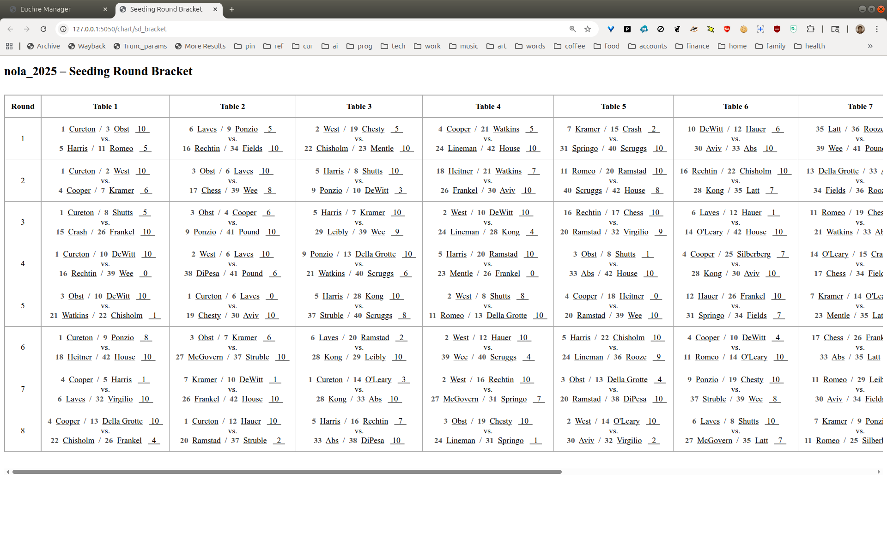
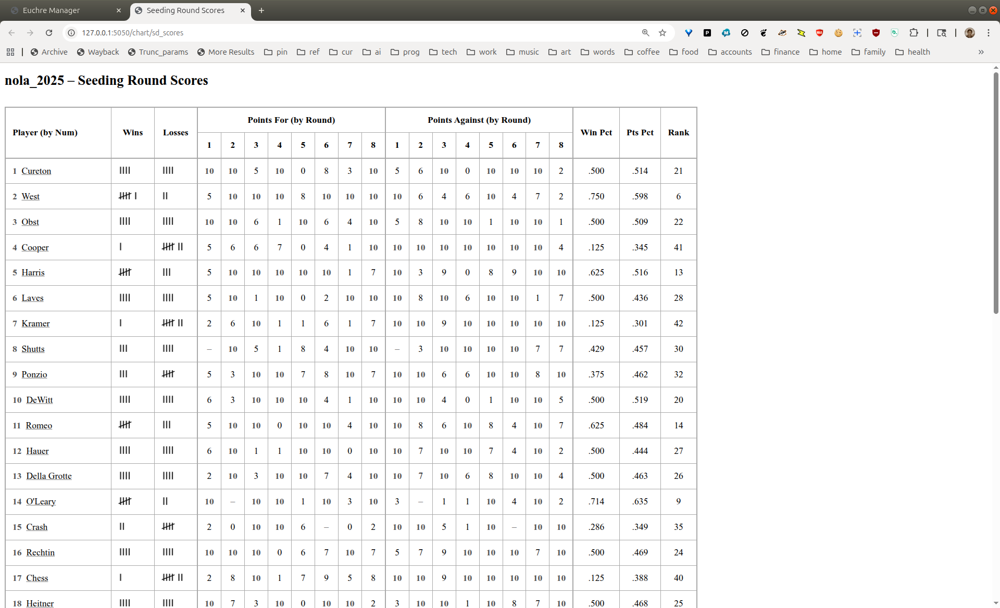
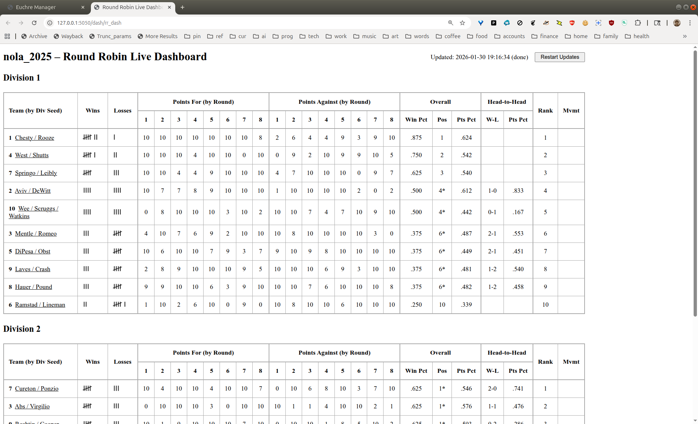
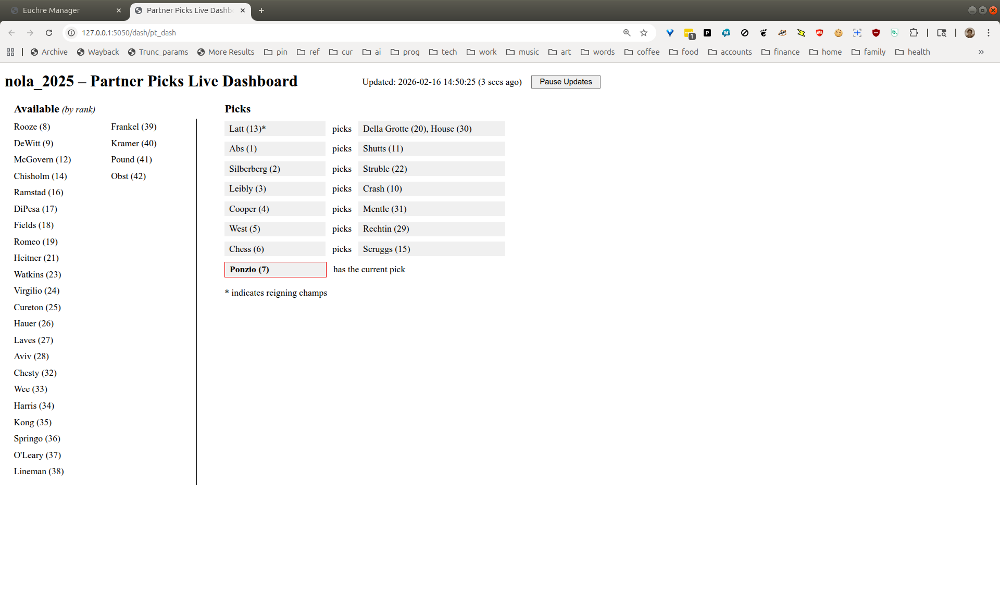
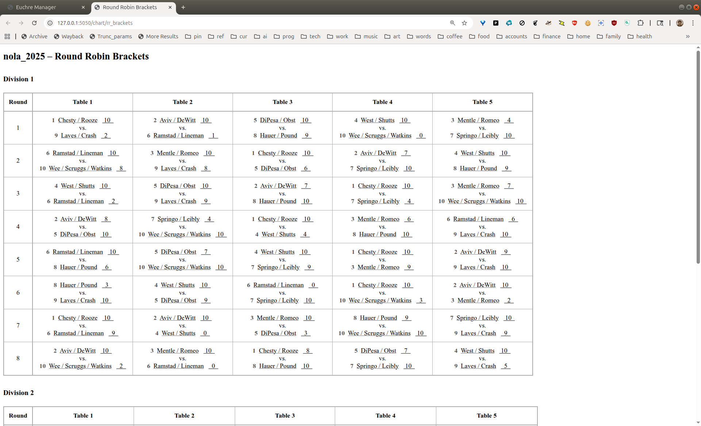
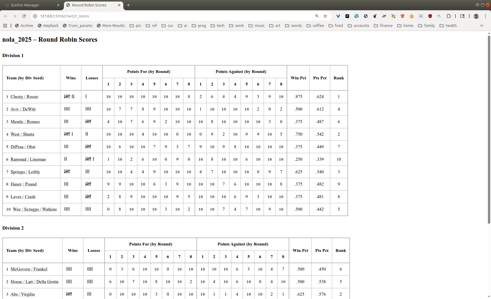
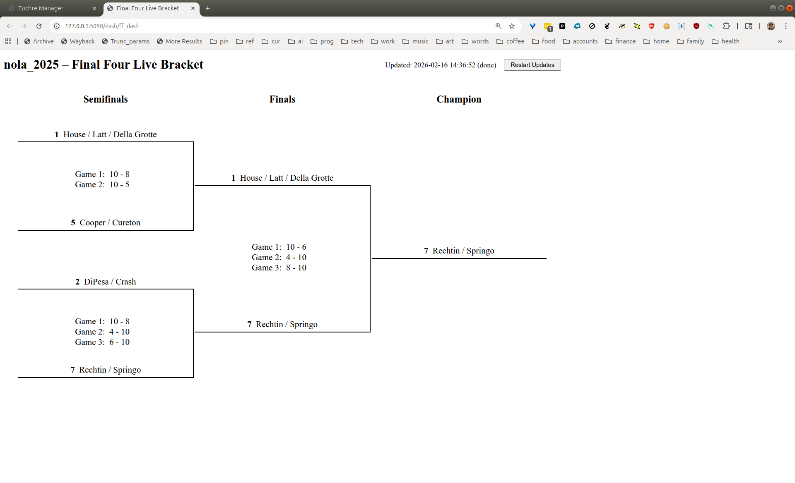

# Charts and Dashboards

*\[Descriptions coming later, only screenshots for now\]*

## Overview

Here is a list of the charts and dashboards, by tournament stage:

**[Seeding Round](#seeding-round)**

- [Seeding Bracket](#seeding-bracket)
- [Seeding Scores](#seeding-scores)
- [Seeding Live Dashboard](#seeding-live-dashboard)

**[Partner Picks](#partner-picks)**

- [Picks Live Dashboard](#picks-live-dashboard)

**[Round Robin](#round-robin)**

- [Round Robin Brackets](#round-robin-brackets)
- [Round Robin Scores](#round-robin-scores)
- [Round Robin Live Dashboard](#round-robin-live-dashboard)

**[Playoffs](#playoffs)**

- [Final Four Live Bracket](#final-four-live-bracket)

## Seeding Round

### Seeding Bracket

  

### Seeding Scores

  

### Seeding Live Dashboard

  

## Partner Picks

### Picks Live Dashboard

  

## Round Robin

### Round Robin Brackets

  

### Round Robin Scores

  

### Round Robin Live Dashboard

  

## Playoffs

### Final Four Live Bracket

  

