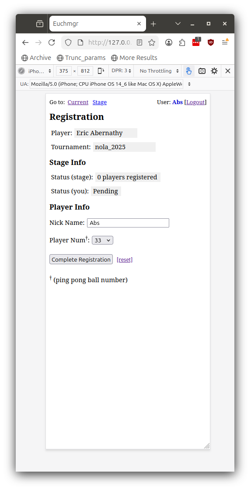
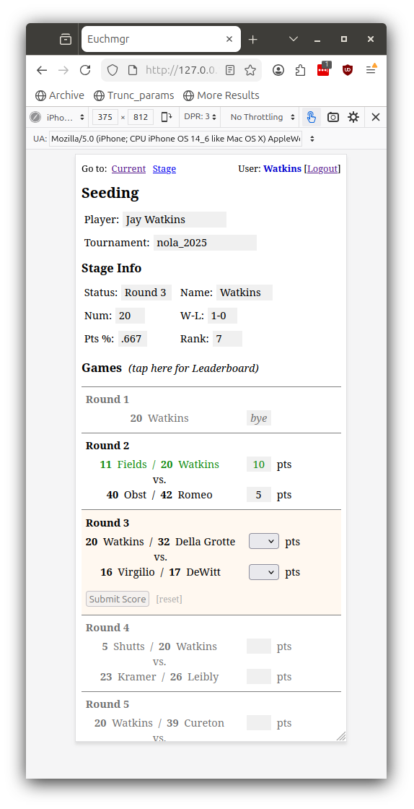
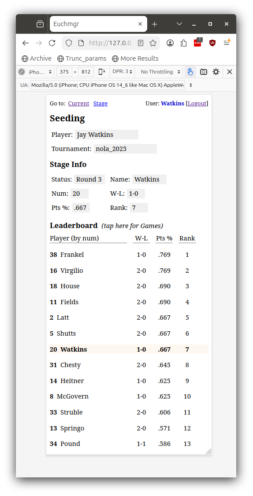
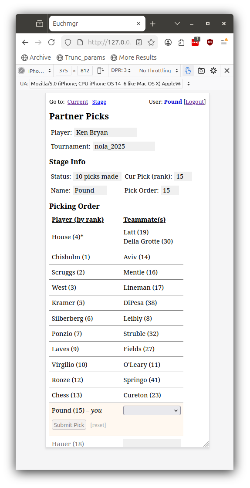
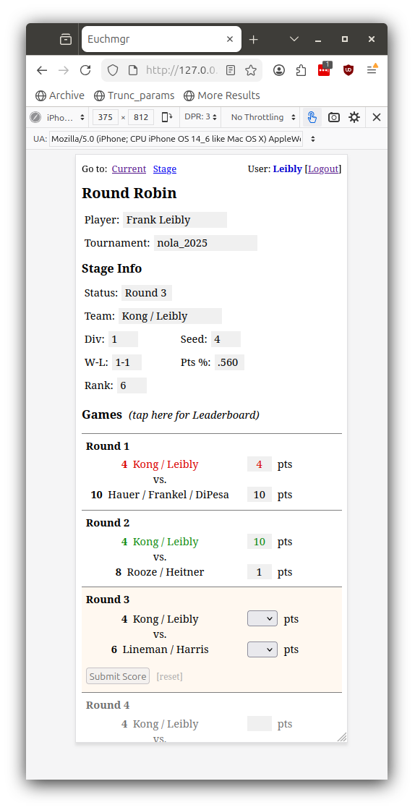
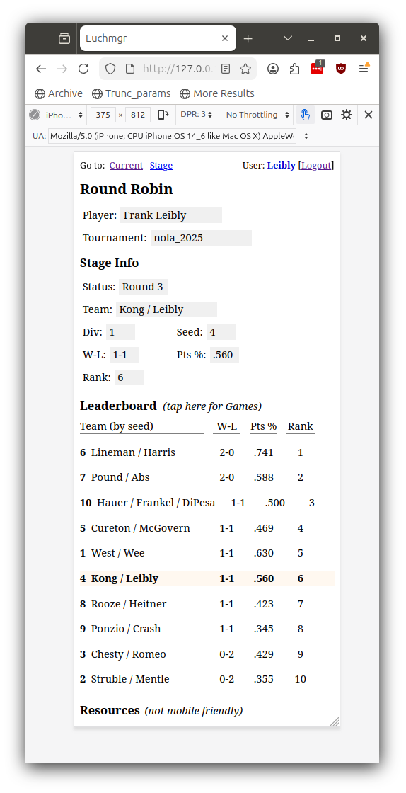

# Mobile UI

*\[Descriptions coming later, only screenshots for now\]*

## Overview

Here is a list of the views:

- [**Registration**](#registration-view) - enter ping pong ball number (if we are doing
  that), and set nick name for the tournament (if desired)
- [**Seeding**](#seeding-view) - submit/accept game scores for seeding round play
- [**Partners**](#partners-view) - track partner picking process, and make a pick on your
  turn
- [**Round Robin**](#round-robin-view) - submit/accept game scores for main tournament
  round robin play

Later we will add views for entering game scores and displaying leaderboards for playoff
rounds.

## Registration View

  

## Seeding View

View player schedule and submit/accept game scores:

  

View seeding round leaderboard:

  

## Partners View

  

## Round Robin View

View team schedule and submit/accept game scores:

  

View round robin leaderboard (for the team's division):

  

